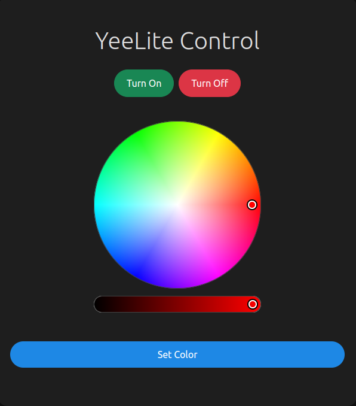

# YeeLite

A web-based control interface for Yeelight smart bulbs, built using Flask.



## Features

- Turn the light on/off
- Adjust brightness
- Set color with an HSV color picker
  
## Installation

1. Clone the repository and install dependencies:
    ```bash
    pip install flask yeelight
    ```

2. Update `bulb_ip` in `app.py` to your Yeelight's IP.

3. Run the app:
    ```bash
    python app.py
    ```

4. Access at `http://<IP_ADDRESS>:5000/` from devices on your local network.

## Usage

Adjust brightness and color via the web interface.
